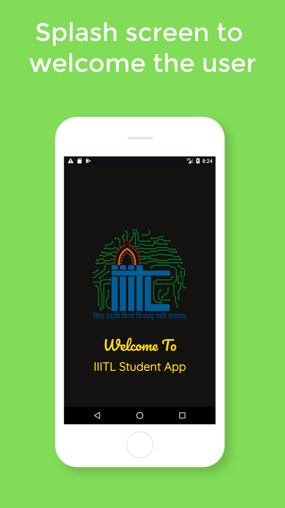
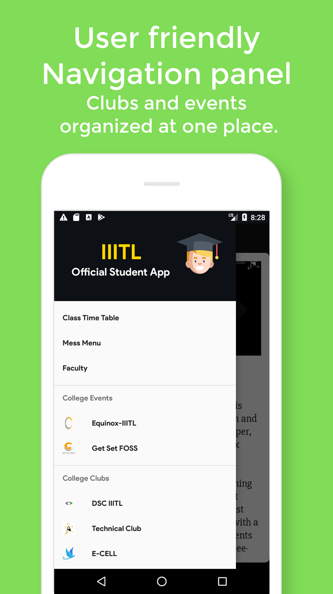
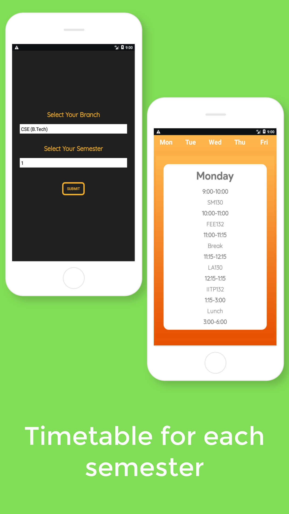
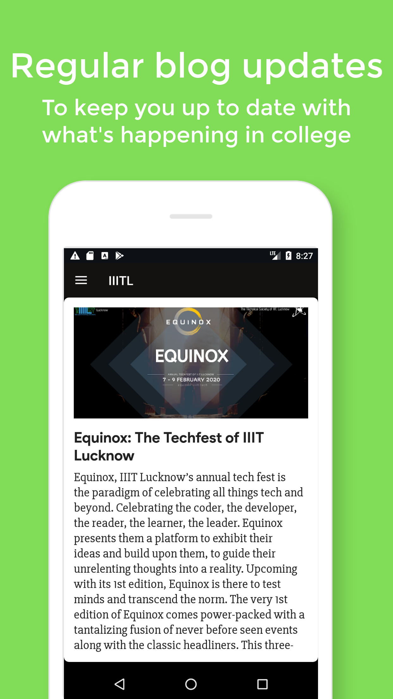

    

# IIITL Student APP
_The Complete App for IIITL Students._

### Roadmap
- [x] Authentication (Google + Email based)
- [x] Link IIIT-L blog to the App
- [x] Add feature to submit articles 
- [x] Add details of faculty members
- [x] Complete Timetable for students
- [x] Add Mess Menu
- [x] Add Clubs and Events
- [x] Add feature to access past year papers

### Blog
Link: http://iiitlblog.blogspot.com/

### Maintainers 
- [Govind Dixit](https://github.com/GOVINDDIXIT)
- [Rohit Verma](https://github.com/refactor-droidyy)

# Screenshots
<table>
   <tr>
      <td></td>
      <td></td>
      <td></td>
  </tr>
   <tr>
      <td></td>
      <td></td>
      <td></td>     
  </tr>
  <tr>
      <td></td>
         
  </tr>
</table>
